# technical-assessment

Technical Assignment:

You’re part of a new and exciting project. The project will allow customers to track a package. Once it is delivered to your homes mailbox, you will be able to lock and unlock your mailbox (EP1) with a mobile app - Assume your team also produced the hardware for the mailbox (EP1) giving you full control. You will need to create the mobile app; your cloud infrastructure will be Azure. Your application will use the mobile phones GPS for location and Bluetooth Low Energy (BLE) to control access to the mailbox (EP1).

1. Provide a structural UML class diagram of the mobile app (I.e. Classes, Interfaces, Components etc..)
2. Implement the following functions as outlined by your UML diagram. Make any assumptions necessary - but please provide your assumptions, imports are not required. Please be specific to BLE and the OS of your choice (iOS or Android only).
   1. Connect to a discovered Mailbox (EP1)
   2. Authenticate user
   3. Send unlock command

## Getting Started
To get a local copy up and running follow the steps below.

### Prerequisites
* Add MAPS_API_KEY to local.default.properties file

### Installation

1. Clone the repo
   ```sh
   git clone https://github.com/heymonheymon3000/technical-assessment.git
   ```
2. Build and install ble-mailbox-central (client) on a device
3. Build and install ble-mailbox-perpherial (server) on a separate device

### Assumptions
* When scanning, filter results to my mailbox only.
* For the ble-mailbox-central use any device Android 10 or lower, it seems like it does pick up devices
* Based on the instructions it looks like I need to show the location of the user not track the location of EP1

## Screen shots
<!---
#### Initial screen of client
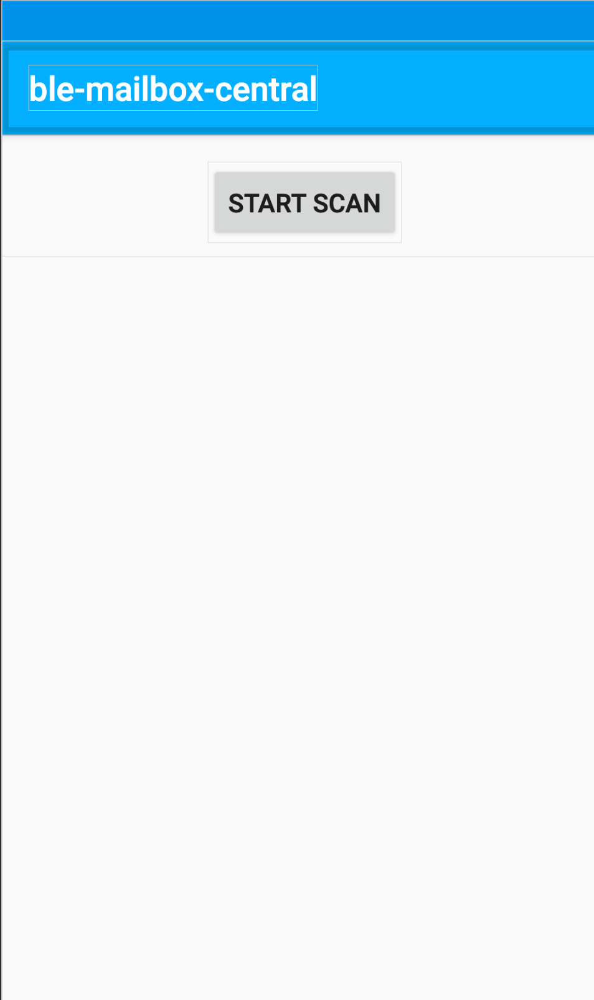

#### Initial screen of server
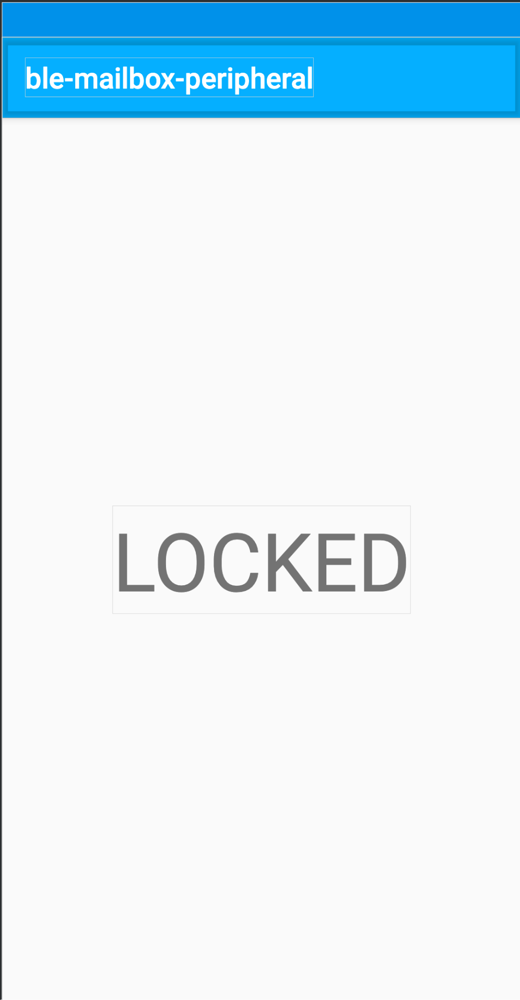

#### User clicked Start Scan and permissions request pop up
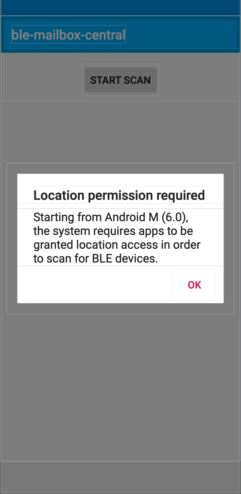

#### Scan results
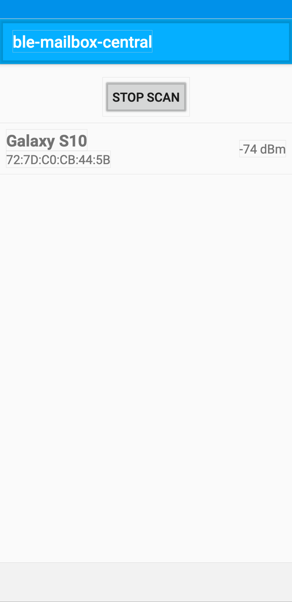

#### User clicked the device to connect
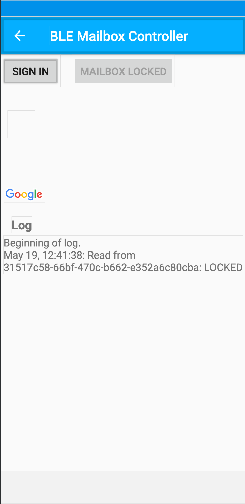

#### User is authenticated
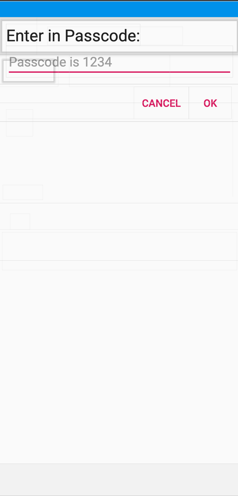

#### User clicked the device to connect
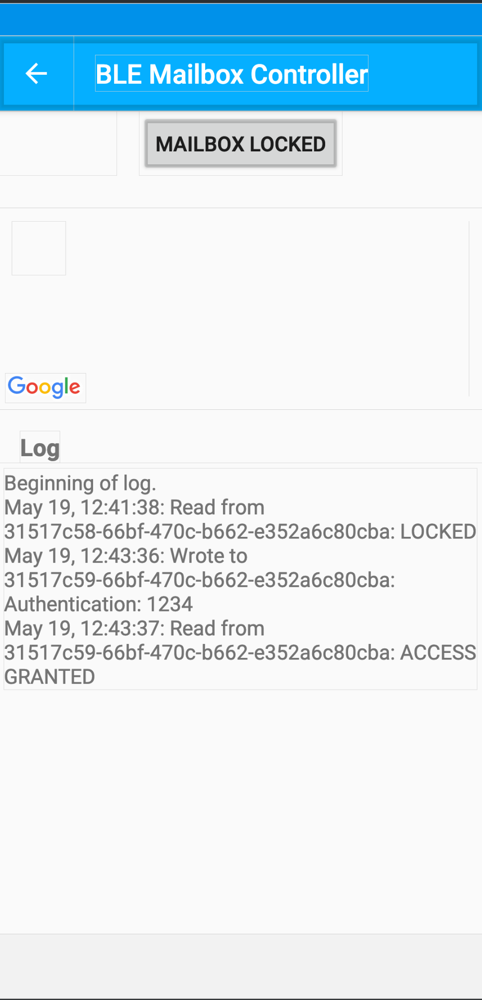

#### Mailbox shows unlocked on client
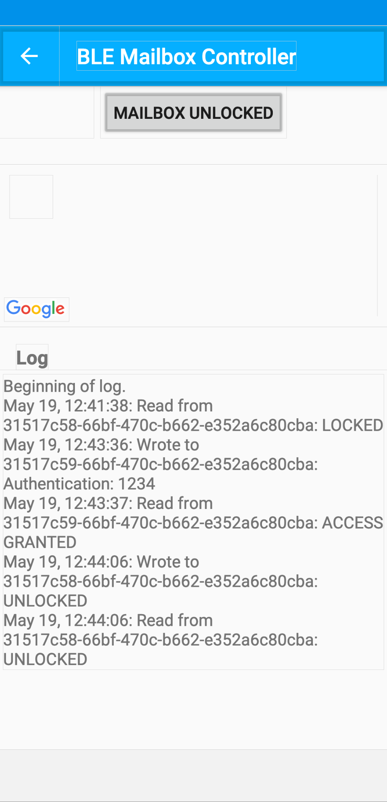

#### Mailbox unlocked on server
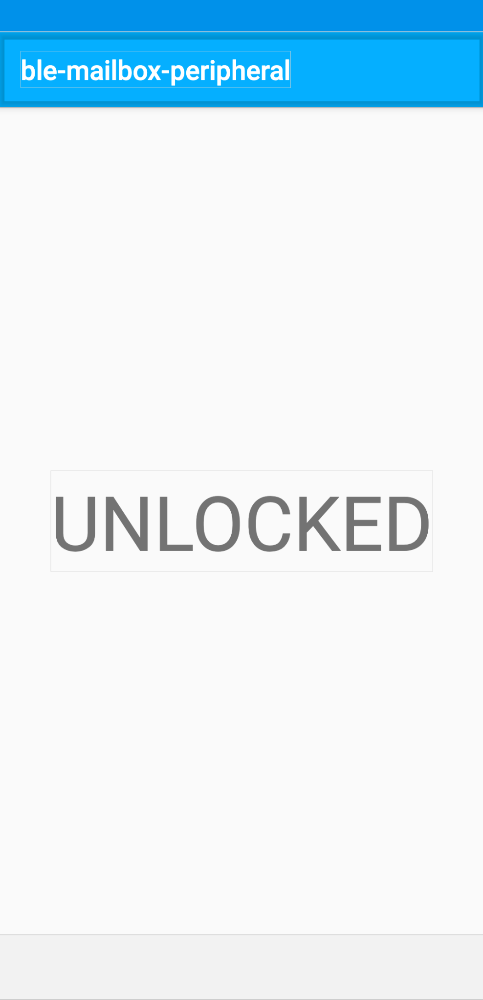
-->
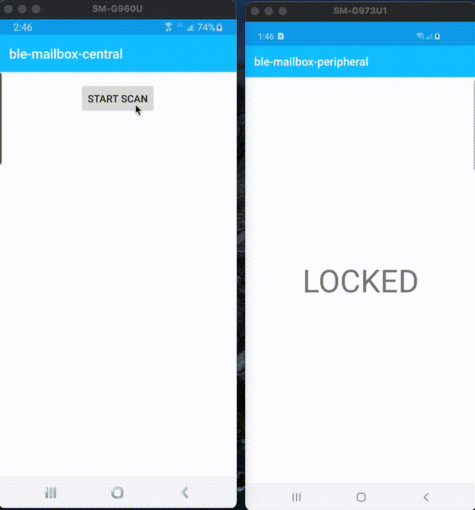

## UML Diagrams
#### Sequence Diagram
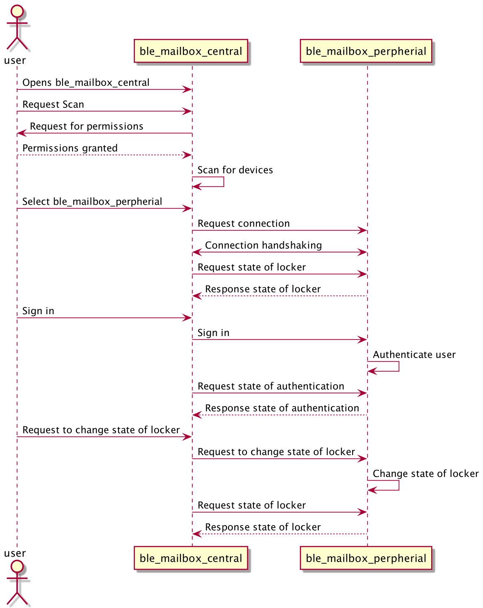
#### Peripheral Class Diagram
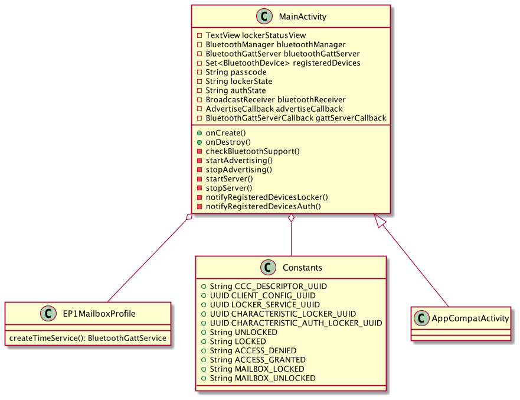
#### Central Class Diagram
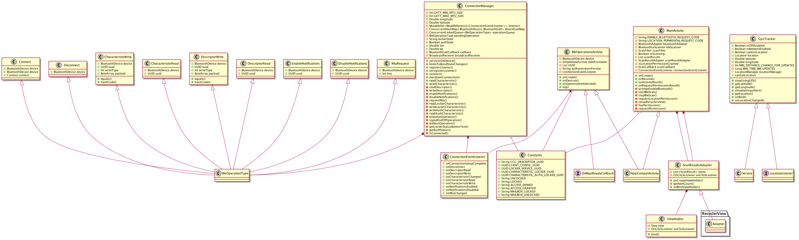